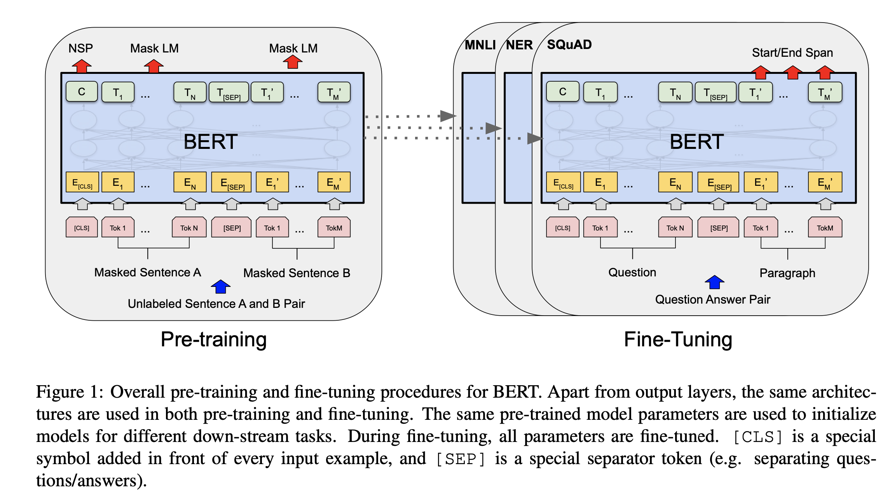
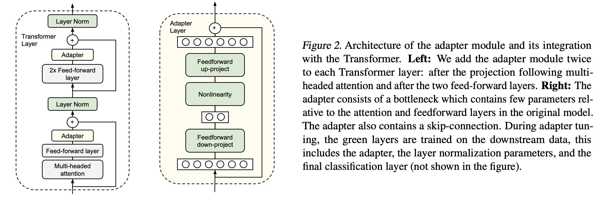
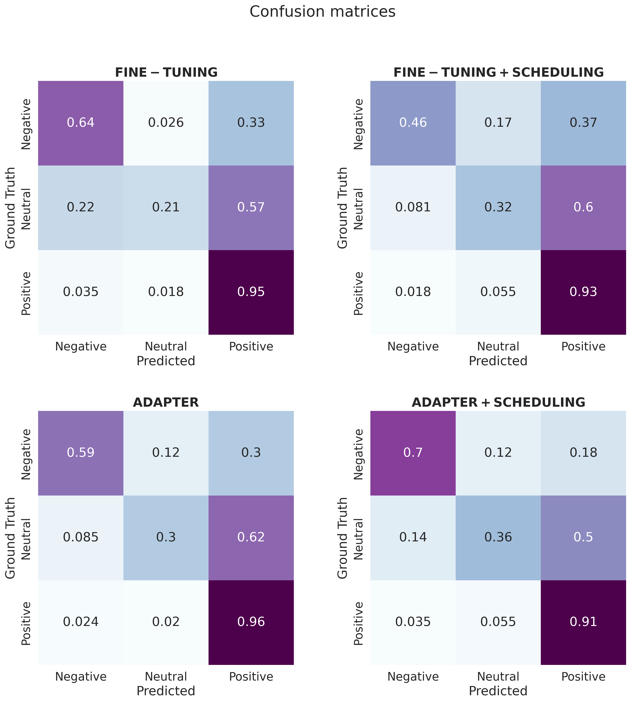

# Aspect-term extraction and Aspect-based sentiment analysis

运行 `sh scripts/install.sh` 以在环境中安装依赖项。

运行 `sh scripts/absa.sh` 或 ` scripts/abte.sh` 训练推理

# 介绍

情感分析，即分析句子中表达的情感，是自然语言处理中的一个重要应用领域。它吸引了品牌的兴趣，品牌希望分析客户反馈，例如调查回复和社交媒体对话，以便根据客户需求调整产品和服务。

然而，基础情感分析尝试检测一个句子的总体极性，而不考虑提到的实体及其方面。因此，引入了一个新任务：基于方面的情感分析（ABSA），这是一种通过方面对数据进行分类并识别与每个方面相关的情感的文本分析技术。

在此存储库中，我们提供了ABSA的两个步骤的可能解决方案：

1. 方面术语提取（ATE）；
2. 基于方面的情感分析（ABSA）。

# 任务描述

让我们考虑一个给定的句子 $s$，例如来自产品评论或社交媒体帖子。
 公司可能希望了解该句子的主要情感，即与每个最重要的方面相关的情感是积极的、消极的还是中立的。

例如，句子 "食物很好吃，但价格有点贵" 有两个不同的极性，每个极性对应一个不同的方面。事实上，关于 **食物** 的情感是积极的，而关于 **价格** 的情感是消极的，这两个信息对于公司来说都是分开感兴趣的。

因此，为了提取这些信息，我们需要首先识别句子的方面，然后提取与每个方面相关的情感。这是我们将在本工作中处理的两个独立任务。

1. 方面术语提取（ABTE）：给定一个句子，识别该句子中出现的所有方面术语；
2. 基于方面的情感分析（ABSA）：给定句子和一个方面术语，识别与该方面术语相关的情感。

显然，第一个任务可以看作是进行第二个任务的预处理步骤，因此，如果我们处理的数据中没有手动标注的方面，我们应该先执行ATE，然后执行ABSA。另一方面，如果方面已经手动标注，我们可以直接执行ABSA，以提取与每个方面相关的情感。

# 数据集

为了训练和测试我们的模型，我们使用一个包含餐厅评论的数据集，该数据集来自 [1] 中的一个预处理版本，该版本来源于 SemEval-2014 ABSA 任务 [2]。

数据以 csv 文件的形式组织，包含以下列：

- **Tokens**：分词后的句子；
- **Tags**：与每个词语相关联的标签列表：'0'表示非方面术语，'1'表示方面术语的开始，'2'表示方面术语的标记；
- **Polarities**：与每个词语相关联的极性列表：'0'表示消极，'1'表示中立，'2'表示积极，'-1'表示非方面术语；

# 模型

为了解决上述问题，我们提供了不同的策略，所有这些策略都基于对预训练BERT模型 [3] 的微调，具体实现由Hugging Face [4] 提供。
 BERT 是一种双向变换器，使用掩蔽语言建模目标和下一个句子预测相结合进行预训练，可以适应多种任务，包括情感分析。

### 架构

这两个任务都使用两种不同的基于BERT的方法：直接微调和适配器，由AdapterHub[5]提供实现。

1. **微调**：微调预训练模型（在我们的例子中是 'bert-base-uncased'），并专门为ATE和ABSE进行训练。因此，想法是更新原始预训练模型的整个副本，但这并不是最高效的方式。下图展示了微调的模型架构：[3]

<p align="center">    </p>

2. **适配器模块**：适配器模块 [6] 被引入作为比微调更高效的方法。在这种情况下，原始模型的参数是固定的，训练的只有少量每个任务特定的参数，这些新的任务特定参数称为适配器。下图展示了适配器架构：[6]

<p align="center">    </p>

具体来说，对于ATE，我们将词汇表中词语的索引列表输入到变换器中。另一方面，对于ABSE，我们首先将方面术语与句子的词汇列表连接如下：

```{note}
    ['w1', 'w2', 'w3', ... , 'wN', '[CLS]', 'aspect']
```

然后，我们将词汇表中词语的索引列表输入到变换器中。

### 优化策略与训练

最后，我们提供了两种不同的优化策略，这两种策略都基于AdamW算法 [7]，其实现由PyTorch [8] 提供。
 此外，我们测试了使用固定学习率的AdamW和使用学习率调度器的AdamW，ATE使用线性调度器，ABSE使用多项式调度器。

训练使用批次大小为8，所有情况训练5个周期，这是BERT模型的推荐做法。ATE使用$3 \times 10^{-5}$的学习率进行训练，ABSE使用$10^{-3}$的学习率，因为第二种方法显示出较不稳定的趋势。

## 总览

结构如下：

1. 文本预处理与归一化；
2. 方面术语提取：训练概述与比较、测试、评估与可视化；
3. 基于方面的情感分析：训练概述与比较、测试、评估与可视化。

由于我们训练了8个不同的模型，训练过程已经分开执行并加载到笔记本中。不过，我们通过训练损失图展示了训练过程。

## 结果：

#### 方面术语提取

关于方面术语提取的最佳设置是使用适配器+调度器，它在方差-偏差平衡方面表现最佳：

| 测试         |        |        |        |        |      | 训练         |        |        |        |        |
| ------------ | ------ | ------ | ------ | ------ | ---- | ------------ | ------ | ------ | ------ | ------ |
|              | 精确度 | 召回率 | F1得分 | 支持度 |      |              | 精确度 | 召回率 | F1得分 | 支持度 |
| 无           | 0.98   | 0.99   | 0.98   | 65477  |      | 无           | 0.98   | 0.99   | 0.98   | 227086 |
| 方面术语开始 | 0.70   | 0.68   | 0.69   | 4022   |      | 方面术语开始 | 0.69   | 0.66   | 0.68   | 11416  |
| 方面术语标记 | 0.83   | 0.61   | 0.70   | 2141   |      | 方面术语标记 | 0.78   | 0.67   | 0.72   | 4710   |
| 准确度       |        |        | 0.96   | 71640  |      |              |        |        | 0.96   | 243212 |
| 平均宏观值   | 0.83   | 0.76   | 0.79   | 71640  |      | 平均宏观值   | 0.82   | 0.77   | 0.79   | 243212 |
| 加权平均值   | 0.96   | 0.96   | 0.96   | 71640  |      | 加权平均值   | 0.96   | 0.96   | 0.96   | 243212 |

提取的术语可视化结果如下：

#### 基于方面的情感分析

ABSA任务的混淆矩阵如下所示：

<p align="center">    </p>

方面术语的句子示例如下：


> The review "they make the BEST spice tuna roll in town, and the asian salad is ok" 
> w.r.t. the aspect "tuna" is positive

> The review "the food is fantastic, but the prices were too high" 
> w.r.t. the aspect "prices" is negative

> The review "the food is fantastic, but the prices were too high" 
> w.r.t. the aspect "food" is positive

> The review "the chicken tastes like plastic, even tough they make the best " 
> w.r.t. the aspect "chicken" is negative

## 参考文献：

[1] **Aspect-Term-Extraction-and-Analysis**, https://github.com/1tangerine1day/Aspect-Term-Extraction-and-Analysis

[2] Maria Pontiki, Dimitris Galanis, John Pavlopoulos, Harris Papageorgiou, Ion Androutsopoulos, and Suresh Manandhar. 2014. **SemEval-2014 Task 4: Aspect Based Sentiment Analysis.** In Proceedings of the 8th International Workshop on Semantic Evaluation (SemEval 2014), pages 27–35, Dublin, Ireland. Association for Computational Linguistics.

[3] Devlin, Jacob and Chang, Ming-Wei and Lee, Kenton and Toutanova, Kristina, **BERT: Pre-training of Deep Bidirectional Transformers for Language Understanding**, DOI: 10.48550/ARXIV.1810.04805

[4] **HuggingFace BERT models**, https://huggingface.co/docs/transformers/model_doc/bert

[5] **AdapterHub: A Framework for Adapting Transformers**, Jonas Pfeiffer et al., Proceedings of the 2020 Conference on Empirical Methods in Natural Language Processing (EMNLP 2020): Systems Demonstrations, https://www.aclweb.org/anthology/2020.emnlp-demos.7

[6] Houlsby, Neil and Giurgiu, Andrei and Jastrzebski, Stanislaw and Morrone, Bruna and de Laroussilhe, Quentin and Gesmundo, Andrea and Attariyan, Mona and Gelly, Sylvain, **Parameter-Efficient Transfer Learning for NLP**, DOI: 10.48550/ARXIV.1902.00751

[7] Loshchilov Ilya, Hutter Frank, **Decoupled Weight Decay Regularization**, DOI: 10.48550/ARXIV.1711.05101

[8] PyTorch: An Imperative Style, High-Performance Deep Learning Library}, Paszke Adam, Gross Sam, Massa Francisco, Lerer Adamm, Bradbury James, Chanan Gregory, Killeen Trevor, Lin Zeming, Gimelshein Natalia, Antiga Luca, Desmaison Alban, Kopf Andreas, Yang Edward, DeVit Zachary, Raison Martin, Tejani Alykhan, Chilamkurthy Sasank, Steiner Benoit, Fang Lu, Bai Junjie, Chintala Soumith, http://papers.neurips.cc/paper/9015-pytorch-an-imperative-style-high-performance-deep-learning-library.pdf

